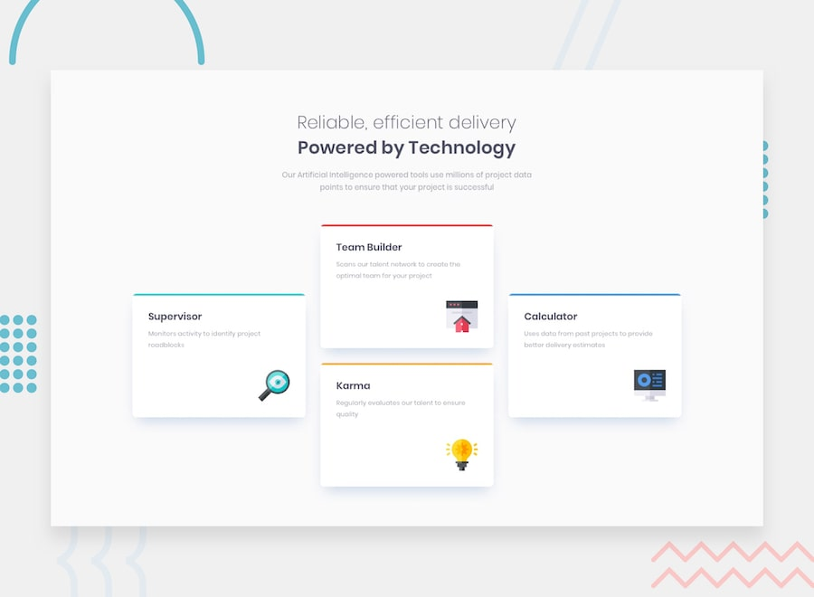

# Frontend Mentor - Four card feature section

This is my solution to the **Four card feature section** challenge on Frontend Mentor.

The goal of this project was to recreate the provided design using semantic HTML and CSS while making the layout responsive for both desktop and mobile screen sizes.

## 📸 Screenshot

## 🔗 Links

- **Live Site:** 
- **Frontend Mentor Solution:**
- **Repository:** https://github.com/lumine404/frontendmentor-four-card-feature-section

## 🚀 Built With

- HTML5
- CSS3
- CSS Grid
- CSS Flexbox
- CSS Media Queries
- Google Fonts

## 🎯 What I Learned

This project helped me improve my understanding of:

- Creating complex layouts using **CSS Grid**.
- Using `grid-template-areas` to position elements in a specific layout.
- Understanding how Grid rows and columns affect the size and position of elements.
- Creating different Grid layouts for desktop and mobile screen sizes.
- Using **media queries** to make a layout responsive.
- Understanding how the **CSS cascade** and source order affect which rules are applied.
- Using `gap` and `row-gap` to control spacing between Grid elements.
- Understanding the difference between `margin`, `padding`, and `gap`.
- Using `transform: translateY()` to adjust the vertical position of elements within a layout.
- Using Flexbox to organize and center the main content.
- Using CSS custom properties (`--variables`) to keep colors consistent throughout the stylesheet.
- Importing and applying the **Poppins** font from Google Fonts.
- Positioning icons inside cards using `position: absolute`.
- Understanding that responsive layouts sometimes require changing the entire Grid structure rather than only changing the column width.

## 💡 Challenges

Some challenges I encountered while building this project included:

- Recreating the unusual desktop arrangement where the cards are not simply placed in a standard row or column.
- Understanding why my first `grid-template-areas` configuration caused the Supervisor and Calculator cards to stretch across multiple rows.
- Figuring out how to create the correct desktop layout without leaving unnecessarily large gaps between the cards.
- Making the cards stack vertically on smaller screens.
- Understanding why changing only `grid-template-columns` in the mobile media query was not enough when the desktop `grid-template-areas` was still active.
- Getting the spacing between the cards right on mobile.
- Understanding how explicit Grid rows can create unexpected empty space.
- Keeping the desktop positioning while resetting the positioning for mobile.
- Adjusting the card dimensions, padding, and icon positioning to more closely match the reference design.

## 🔮 Future Improvements

For future projects, I want to continue improving my:

- Responsive design skills.
- CSS Grid and Flexbox knowledge.
- Understanding of the CSS cascade and specificity.
- Ability to recreate designs accurately from reference images.
- Typography, spacing, and visual hierarchy.
- Accessibility practices.
- CSS architecture and code organization.
- Ability to write cleaner and more maintainable CSS.
- Understanding of how to build layouts that adapt naturally instead of relying on fixed positioning.

## 👤 Author

**Serine (Lumine)**

- GitHub: https://github.com/lumine404
- Frontend Mentor: https://www.frontendmentor.io/profile/lumine404